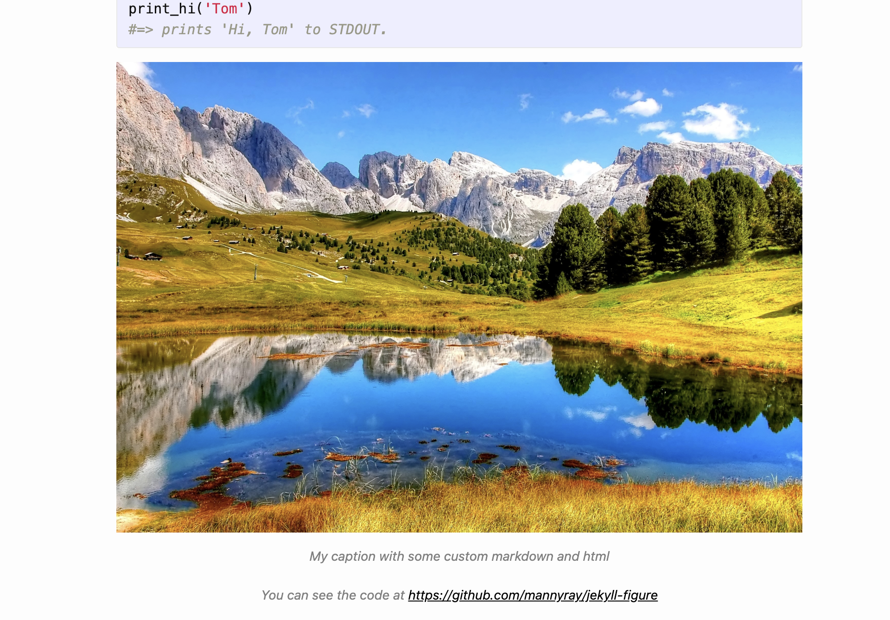

# jekyll-figure

Forked repo of the work in https://github.com/paulrobertlloyd/jekyll-figure.

## What I changed

Slightly modified the code structure for easier use and import in my personal website based to how I structure other personal plugins (e.g. https://github.com/mannyray/jekyll-side-bar) - the code is contained within `lib/jekyll-figure` where the folder `jekyll-figure` needs to be copied to your jekyll site's `_plugin` directory. 

In addition, I added a default styling option that is to be placed in your site's `css/main.scss` file:

```css
---
---

.figcaption-default {
    text-align: center;
    font-style: italic;
    color: grey;
    
    a {
        text-decoration: underline;
    }

    /* unvisited link */
    a:link {
        color: black;
    }

    /* visited link */
    a:visited {
        color: black;
    }

    /* mouse over link */
    a:hover {
        color: black;
    }

    /* selected link */
    a:active {
        color: black;
    }
}
```

as the original `lib/jekyll-figure/jekyll-figure.rb` was slightly modified to now have `figure_class = " class\=\"figcaption-default\""` in the block:

```ruby
# Class name(s)
figure_class = " class\=\"figcaption-default\""
unless @class.nil?
  figure_class = @class.gsub!(/\A"|"\Z/, "")
  figure_class = " class\=\"#{figure_class}\""
end
```

## Testing

`test_site` was added to demonstrate the import and `figcaption-default` styling. For this I did not move the `jekyll-figure` within `test_site/plugins` but instead modified `test_site/_config.yml` to have specified `plugins_dir: ./../lib` to use this repository's `lib/jekyll-figure` directory.

To be able to use `figcaption-default`, in addition to creating `css/main.scss`, I had to modify `test_site/_layouts/head.html` to have:

```html
<head>
    <link rel="stylesheet" href="{{ "/css/main.css" | prepend: site.baseurl }}">
</head>
```

To run the site in `test_site`, `cd` into the directory and run `jekyll serve`. You will see the caption:



Succesfully using captions in https://szonov.com/programming/2023/12/25/the-bionicle-man/ as well.
